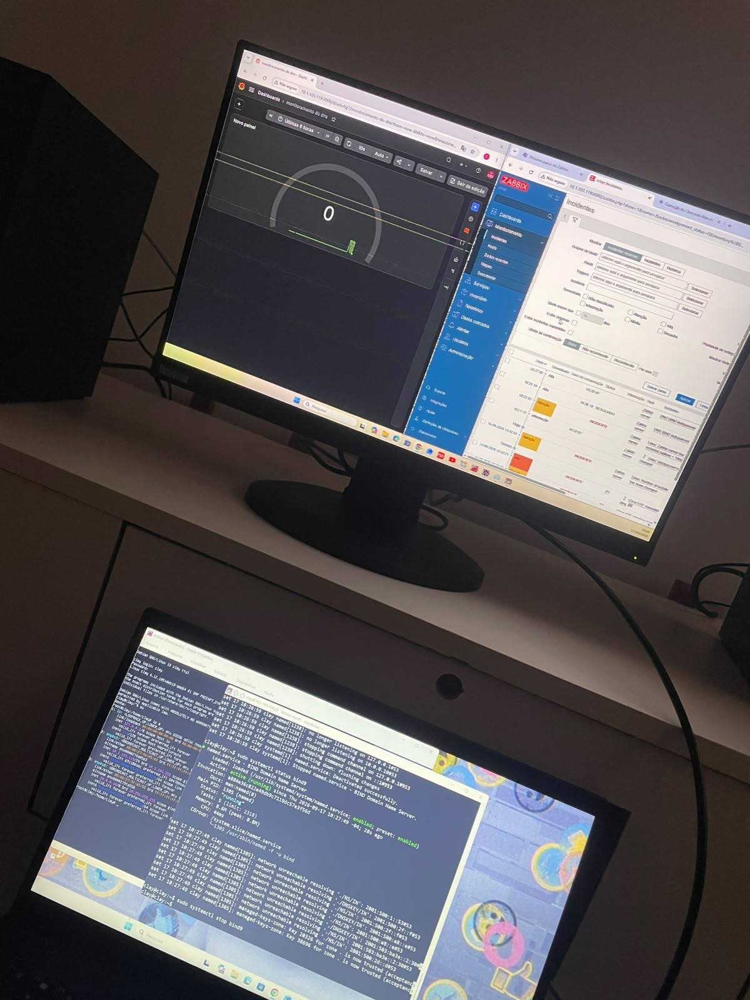
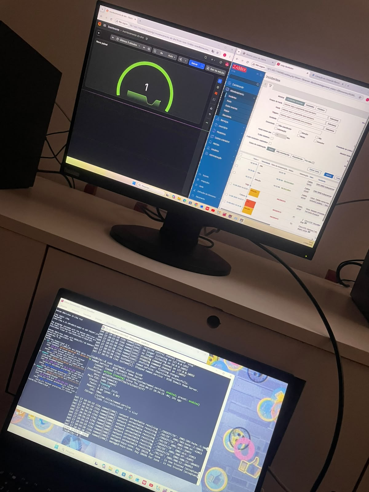

# 📊 Laboratório Zabbix e Grafana

Laboratório prático desenvolvido para estudar **monitoramento de infraestrutura e serviços de rede**, utilizando **Zabbix** e **Grafana** em ambiente Linux.

## Objetivo

Praticar o monitoramento de recursos e serviços de um servidor, acompanhando informações através de dashboards e alertas.

##  Tecnologias utilizadas

-  Debian Linux
-  Zabbix
-  Grafana
-  BIND9 (DNS)
-  Zabbix Agent

## Atividades realizadas

- Instalação e configuração do Zabbix
- Configuração do Zabbix Agent
- Monitoramento do servidor Linux
- Monitoramento do serviço DNS BIND9
- Integração do Zabbix com o Grafana
- Criação de dashboard para visualização dos dados
- Testes de monitoramento e disponibilidade dos serviços

## Dashboard

Dashboard desenvolvido no Grafana para visualizar as informações coletadas pelo Zabbix.

> A imagem abaixo apresenta o resultado do dashboard desenvolvido durante o laboratório.

## Aprendizados

Este laboratório contribuiu para a prática de conceitos relacionados a:

- Monitoramento de infraestrutura
- Administração Linux
- Serviços de rede
- DNS
- Zabbix
- Grafana
- Análise de disponibilidade e desempenho

## Autor

**Clay Pierre**

Estudante de Tecnologia em Redes de Computadores.
